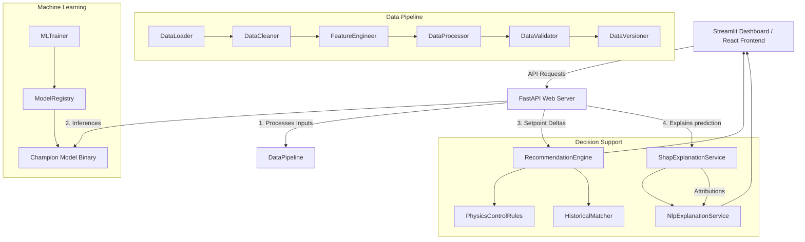

# System Architecture Document

This document details the architectural layout, patterns, and design patterns utilized in the **Grade Change Intelligence System**.

---

## 1. Modular System Interactions

The codebase is split into separate logic tiers, decoupling core computation, web APIs, model representations, and UI presentation:

---

## 2. SOLID Principle Implementation

### Single Responsibility Principle (SRP)
Each module has exactly one reason to change:
- `backend/app/pipeline/cleaner.py`: Standardizes telemetry and clips outliers.
- `backend/app/ml/evaluator.py`: Focuses purely on computing classification scores (Precision, Recall, F1).
- `backend/app/recommendation/rules.py`: Computes physical gains corrections.
- `backend/app/xai/nlp_explainer.py`: Formulates text summaries for operators.

### Open/Closed Principle (OCP)
The class `BaseMLClassifier` in `backend/app/ml/base_model.py` establishes a strict interface contract. Concrete model classes (e.g. `RandomForestWrapper`, `XGBoostWrapper`) inherit from it. Adding a new regression model or LSTM prediction engine is done by writing a new subclass without rewriting the API routers or endpoints.

### Liskov Substitution Principle (LSP)
The `MLTrainer` and `ModelRegistry` accept any subclass implementation of `BaseMLClassifier` interchangeably, relying on the uniform `fit()`, `predict()`, and `save()` contracts.

### Interface Segregation Principle (ISP)
Routers are split by logical concerns. The prediction router focuses on `POST /predict`, the recommendation router on `POST /recommend`, and the XAI router on `POST /explain`.

### Dependency Inversion Principle (DIP)
High-level REST endpoints depend on abstract service definitions. In production, real models are injected, whereas in testing, mock models are injected.

---

## 3. Core Data Flow

1.  **Ingestion**: Raw telemetry (from DCS/SCADA systems) is parsed from multiple CSV/Excel logs.
2.  **Preprocessing**: The pipeline calculates rolling averages, rates of change, and handles missing sensor parameters.
3.  **Inference**: Telemetry is converted into feature vectors and scored by the champion model.
4.  **Recommendation**: Physical control rules calculate stock flow, steam, and speed adjustments. The historical engine queries nearest-neighbor matches for context.
5.  **Explainability**: The SHAP service calculates attributions, and the NLP service translates them into plain-text summaries.
6.  **Presentation**: Results are sent to the Streamlit command center dashboard.
