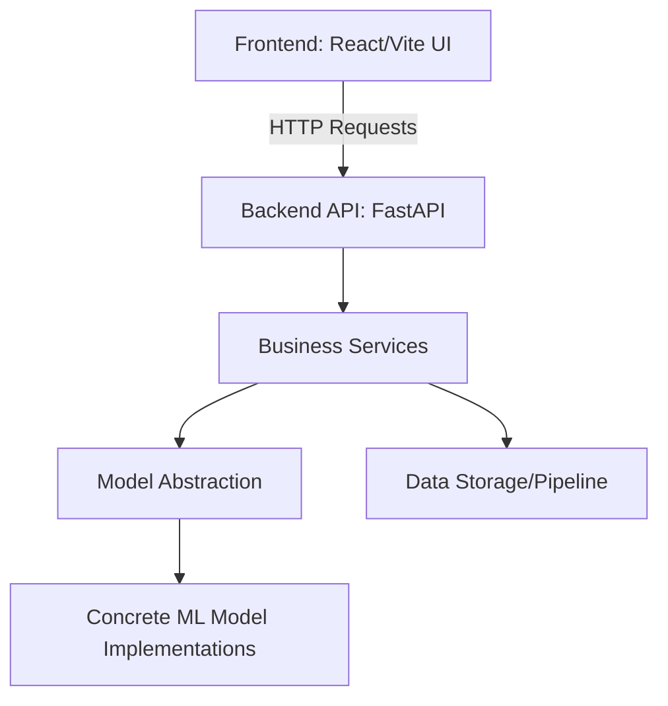

# System Architecture Document

This document details the architectural layout, patterns, and design patterns utilized in the **Grade Change Intelligence System**.

## 1. Clean Architecture Overview

The codebase is split into separate logic tiers, decoupling core computation, web APIs, model representations, and UI presentation:

## 2. SOLID Principle Implementation

### Single Responsibility Principle (SRP)
Each module in `backend/app` has exactly one reason to change:
- `core/config.py`: Handles loading configuration from yaml/env.
- `schemas/`: Purely contains request/response structural definitions.
- `services/prediction_service.py`: Orchestrates feeding inputs to the ML model and collecting results.
- `services/validation_service.py`: Performs bounds checks on incoming telemetry.

### Open/Closed Principle (OCP)
The class `BaseMLModel` in `models/base.py` establishes a strict interface contract. Concrete model classes (e.g. `GradeTransitionModel` in `models/grade_transition_model.py`) inherit from it. Adding a new regression model or LSTM prediction engine is done by writing a new subclass without rewriting the API routers or endpoints.

### Liskov Substitution Principle (LSP)
The `PredictionService` accepts any subclass implementation of `BaseMLModel`. The service interacts with it via `.predict()` or `.fit()` without depending on internal class details (e.g., whether it runs Scikit-learn, PyTorch, or a rule-based engine).

### Interface Segregation Principle (ISP)
Routers are split by logical concerns. The prediction router focuses on `POST /predict`, while the monitoring router focuses on `GET /status` or telemetry ingestion.

### Dependency Inversion Principle (DIP)
High-level api endpoints depend on abstract service definitions. In production, real models are injected, whereas in testing, mock models are injected.

## 3. Data Flow

1. **Ingestion**: Raw telemetry (from DCS/SCADA systems) is pushed via API or parsed by scripts.
2. **Preprocessing**: The pipelines calculate rolling averages and rates of change.
3. **Inference**: Telemetry is converted into feature vectors and scored by the model.
4. **Presentation**: Predictions (e.g. "Transition state active", "Estimated time to reach setpoint: 4 minutes") are sent to the React frontend.
