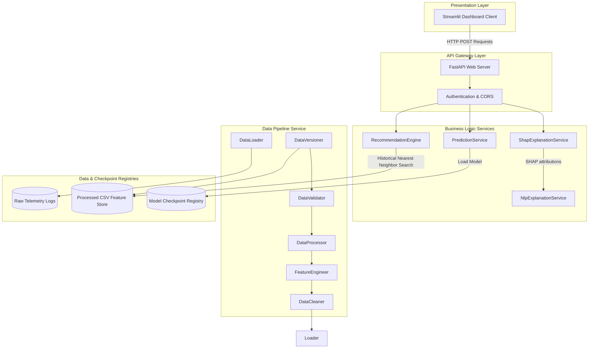
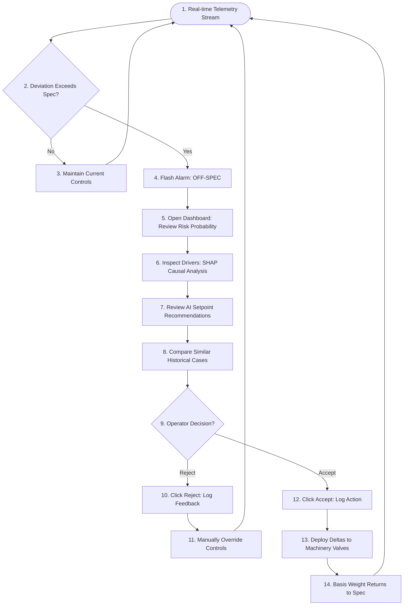
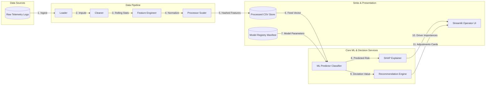
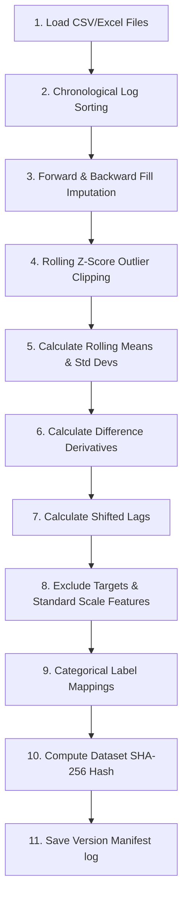
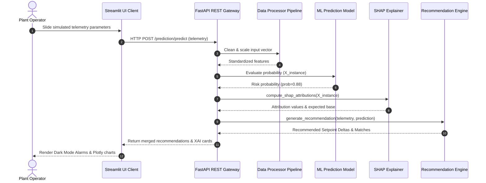
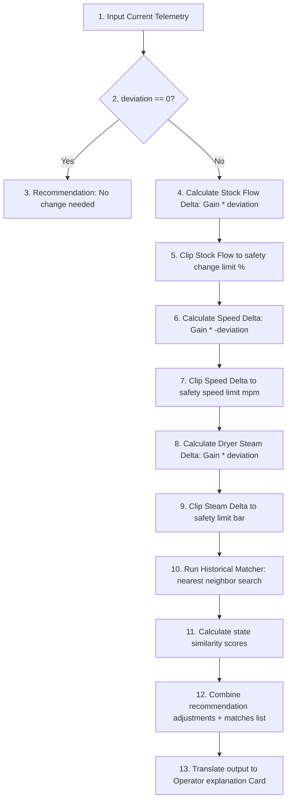

# Smart India Hackathon (SIH) - Presentation Assets Catalog

This document catalog contains every diagram required for the Grade Change Intelligence presentation slides, rendered using **Mermaid** and standalone vector **SVG** wireframes.

---

## 1. System Architecture Diagram
Depicts the decoupled clean architecture layers from operator interactions to backend services.



---

## 2. Operator Flowchart
Step-by-step control room operator workflow during off-specification basis weight anomalies.



---

## 3. Use Case Diagram
Maps actor roles to specific machine interactions.

```mermaid
leftToRightDirection
graph TD
    subgraph Users
        Operator((Plant Operator))
        DataScientist((Data Scientist))
        Admin((System Admin))
    end

    subgraph Use Cases
        UC1[Monitor Real-time Telemetry]
        UC2[Inspect Off-Spec Predictions]
        UC3[Apply Recommendation Deltas]
        UC4[Export PDF Quality Reports]
        UC5[Trigger Model Retraining]
        UC6[Verify Pipeline Manifests]
        UC7[Configure Gains & Safety Limits]
        UC8[Rotate Application Logs]
    end

    Operator --> UC1
    Operator --> UC2
    Operator --> UC3
    Operator --> UC4

    DataScientist --> UC5
    DataScientist --> UC6
    
    Admin --> UC7
    Admin --> UC8
```

---

## 4. Data Flow Diagram (DFD Level 1)
Details the flow of telemetry data from machines, through ML inferences, to operator displays.



---

## 5. Pipeline Diagram
Details the execution sequence of cleaning, feature engineering, and manifest version registration.



---

## 6. Sequence Diagram
Timeline of user interactions, REST backend services, and serialization registries.



---

## 7. Dashboard Wireframe (SVG View)
Vector schematic diagram illustrating the industrial command center user interface layout.

```xml
<svg width="800" height="500" viewBox="0 0 800 500" fill="none" xmlns="http://www.w3.org/2000/svg">
  <!-- General Background -->
  <rect width="800" height="500" fill="#0b0f19" rx="8" />
  
  <!-- Sidebar Navigator -->
  <rect width="180" height="500" fill="#0f172a" />
  <line x1="180" y1="0" x2="180" y2="500" stroke="#1e293b" />
  
  <!-- Sidebar Branding -->
  <circle cx="90" cy="50" r="24" fill="#1e3d59" />
  <text x="90" y="54" fill="#ffffff" font-family="Helvetica" font-size="11" text-anchor="middle">GRADE CHANGE</text>
  <text x="90" y="100" fill="#94a3b8" font-family="Helvetica" font-size="10" text-anchor="middle">Operator Terminal</text>
  
  <!-- Sidebar Menu Buttons -->
  <rect x="10" y="130" width="160" height="30" rx="4" fill="#1e293b" />
  <text x="25" y="149" fill="#f1f5f9" font-family="Helvetica" font-size="11">Overview</text>
  <text x="25" y="189" fill="#94a3b8" font-family="Helvetica" font-size="11">Predictions</text>
  <text x="25" y="229" fill="#94a3b8" font-family="Helvetica" font-size="11">Analytics</text>
  <text x="25" y="269" fill="#94a3b8" font-family="Helvetica" font-size="11">Recommendations</text>
  
  <!-- Header Block -->
  <text x="200" y="40" fill="#ffffff" font-family="Helvetica" font-size="18" font-weight="bold">Machinery Overview Control Room</text>
  <rect x="200" y="60" width="580" height="35" rx="4" fill="#7f1d1d" stroke="#f87171" />
  <text x="215" y="81" fill="#f87171" font-family="Helvetica" font-size="11" font-weight="bold">🚨 ALARM: OFF-SPEC DEVIATION | Basis Weight exceeds target by +2.00 gsm</text>
  
  <!-- Telemetry Sensor Cards -->
  <rect x="200" y="110" width="135" height="70" rx="6" fill="#1e293b" stroke="#334155" />
  <text x="215" y="130" fill="#94a3b8" font-family="Helvetica" font-size="10">Pulp Stock Flow</text>
  <text x="215" y="155" fill="#f1f5f9" font-family="Helvetica" font-size="16" font-weight="bold">450.0 m³/h</text>
  
  <rect x="345" y="110" width="135" height="70" rx="6" fill="#1e293b" stroke="#334155" />
  <text x="360" y="130" fill="#94a3b8" font-family="Helvetica" font-size="10">Dryer Steam</text>
  <text x="360" y="155" fill="#f1f5f9" font-family="Helvetica" font-size="16" font-weight="bold">4.20 bar</text>

  <rect x="490" y="110" width="135" height="70" rx="6" fill="#1e293b" stroke="#334155" />
  <text x="505" y="130" fill="#94a3b8" font-family="Helvetica" font-size="10">Machine Speed</text>
  <text x="505" y="155" fill="#f1f5f9" font-family="Helvetica" font-size="16" font-weight="bold">850.0 mpm</text>

  <rect x="635" y="110" width="145" height="70" rx="6" fill="#1e293b" stroke="#334155" />
  <text x="650" y="130" fill="#94a3b8" font-family="Helvetica" font-size="10">Scanner Weight</text>
  <text x="650" y="155" fill="#f87171" font-family="Helvetica" font-size="16" font-weight="bold">82.00 gsm</text>
  
  <!-- Left Side: Recommendation Card -->
  <rect x="200" y="200" width="370" height="180" rx="6" fill="#1e1b4b" stroke="#6366f1" />
  <text x="215" y="225" fill="#f1f5f9" font-family="Helvetica" font-size="12" font-weight="bold">💡 AI Controller Setpoint Advice</text>
  <text x="215" y="255" fill="#e2e8f0" font-family="Helvetica" font-size="10">Suggested Adjustments to regain specifications:</text>
  <text x="215" y="280" fill="#f87171" font-family="Helvetica" font-size="11" font-weight="bold">Pulp Flow: -11.0 m³/h  |  Speed: -4.2 mpm  |  Steam: +0.8 bar</text>
  
  <!-- Action Buttons -->
  <rect x="215" y="325" width="120" height="30" rx="4" fill="#064e3b" />
  <text x="275" y="344" fill="#34d399" font-family="Helvetica" font-size="11" text-anchor="middle">✔ Accept</text>
  
  <rect x="345" y="325" width="120" height="30" rx="4" fill="#7f1d1d" />
  <text x="405" y="344" fill="#f87171" font-family="Helvetica" font-size="11" text-anchor="middle">❌ Reject</text>
  
  <!-- Right Side: Risk Meter Gauge -->
  <rect x="585" y="200" width="195" height="180" rx="6" fill="#1e293b" stroke="#334155" />
  <text x="682" y="225" fill="#f1f5f9" font-family="Helvetica" font-size="12" font-weight="bold" text-anchor="middle">Deviation Risk</text>
  <path d="M 610,320 A 70,70 0 0,1 750,320" fill="none" stroke="#7f1d1d" stroke-width="20" />
  <path d="M 610,320 A 70,70 0 0,1 680,250" fill="none" stroke="#064e3b" stroke-width="20" />
  <text x="682" y="315" fill="#f87171" font-family="Helvetica" font-size="28" font-weight="bold" text-anchor="middle">88.0%</text>
  
  <!-- Lower Section: Operator Logs -->
  <rect x="200" y="395" width="580" height="85" rx="6" fill="#1e293b" stroke="#334155" />
  <text x="215" y="415" fill="#94a3b8" font-family="Helvetica" font-size="11" font-weight="bold">Action Decision Log</text>
  <text x="215" y="440" fill="#f1f5f9" font-family="Helvetica" font-size="10">15:43:29 | GRADE_A | Flow Delta: -11.0 | Action: ACCEPTED (Valves optimized)</text>
  <text x="215" y="460" fill="#f1f5f9" font-family="Helvetica" font-size="10">15:35:10 | GRADE_B | Flow Delta: +14.2 | Action: REJECTED (Speed tear limit overrides)</text>
</svg>
```

---

## 8. Recommendation Workflow
Logic loop processing control gains calculations and historical neighbor matches.


